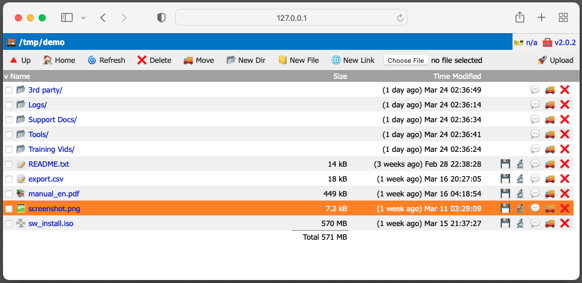

# WFM - Web File Manager

WFM is a lightweight web based file manager. It allows to perform
basic file and folder operations such as upload, download, rename, move,
delete files and organize directory tree structure. Text, markup and markdown
files can be edited directly in the browser. WFM can also create and open
bookmarks, link and shortcut files, list inside archives and ISO files.



## Usage

You can use it as a web interface for a NAS box, FTP server, a "personal cloud",
document sharing site or a lightweight CMS. The app can also serve static html
files from a directory which you can manage as an admin. See usage scenarios
for more information.

WFM is a standalone service with it's own web server. No need for Apache, Nginx, PHP, etc.
It runs directly from `systemd`, `sysvinit`, `launchd`, `rc` or Docker.
TLS/SSL is supported with automatic certificate generation by Lets Encrypt / Certbot.

Much like Docker, Kubernetes, Hugo, etc. WFM is written in Go language. The binary is
statically linked, fully self contained and has zero external dependencies. Icons are
unicode emojis. CA Certs are embedded at built time. No need for Python, PHP, SQL,
JavaScript, Node or any other bloat. WFM outputs validated HTML 4.01 without JavaScript.
It works on both modern and legacy web browsers going back to Internet Explorer 2.x and
Netscape 3.x.

## Directory tree

WFM exposes a directory tree via web based interface. The primary method of specifying
the root directory is chroot via `-chroot=/dir` flag, or by your service manager. For
example Systemd service file `RootDirectory=` directive. WFM is not intended to be used
without chroot.

For some services like Docker, a subdirectory must be used, this can be specified by
`--prefix=/subdir:/` flag. A subdirectory should not be considered secure and you should
assume users can access files above the prefix up to chroot.

## Deployment scenarios

### Systemd

You can have either Systemd, or WFM perform chroot and setuid. If you are binding to
port 80 (and/or 443), you need to start WFM as root.

#### WFM as root

Like any other web server, WFM starts the process as `root` to binds to port 80 or 443. Then
it setuids to a desired user specified with `-setuid=myuser`. Similarly the WFM performs
chroot to a directory specified with `-chroot=/datadir`. An example service file is provided
[here](service/systemd/wfm80.service).

#### WFM as user

You can specify Systemd `User=` other than root if you also use `RootDirectory=` for
chroot and use non privileged port (above 1024, eg. 8080), or your binary has adequate
capabilities set. Example [here](service/systemd/wfm8080.service).

#### Systemd Install

To install wfm service file copy it to `/etc/systemd/system/wfm.service` edit the
configuration and run:

```shell
$ sudo systemctl daemon-reload
$ sudo systemctl enable --now wfm
```

### Launchd

An example launchd service file is provided [here](service/launchd/tc.tenox.wfm.plist).

### Docker

Docker hub: `tenox7/wfm:latest`
GCR.io: `gcr.io/tenox7/wrp:latest`

Run:

```shell
$ docker run -d -p 8080:8080 --user 1234:1234 -v /some/host/dir:/data tenox7/wfm
```

WFM docker container expects the data directory to be mounted in `/data` inside the
container. This can be overridden with `--prefix` flag if necessary.

To supply json password file to the docker container you can mount it:

```shell
$ docker run -d \
      -p 8080:8080 \
      --user 1234:1234 \
      -v /some/host/dir:/data \
      -v /some/dir/wfmpasswd.json:/etc/wfmusers.json
      tenox7/wfm -passwd=/etc/wfmusers.json
```

If not using password file you may also need add `--nopass_rw`.

If you don't specify `--user` in Docker run, you may also need `--allow_root` since 
WFM will be running as user id 0 inside the container.

## SSL / TLS / Auto Cert Manager

You can use WFM as a SSL / TLS / https secure web server with Lets Encrypt Auto Cert Manager.
ACM will automatically obtain SSL certificate for your site as well as the keypair.

Example deployment with SSL:

```text
ExecStart=/usr/local/sbin/wfm \
	-passwd=/usr/local/etc/wfmpasswd.json \
	-chroot=/var/www/html \
	-setuid=user \
	-addr=:443 \
	-acm_addr=:80 \
	-acm_dir=/.certs \
	-acm_host=www.snakeoil.com
```

The flag `-addr=:443` makes WFM listen on port 443 for https requests.
Flag `-acm_addr=:80` is used for Auto Cert Manager to obtain the cert
and then redirect to port 443/https. `-acm_dir=/.certs` is where the
certificate and key are stored. This directory is inside chroot jail.
You may want to use `--prefix` inside chroot to hide it.

The `-acm_host=` is a repeated flag that adds specific host to a whitelist.
ACM will only obtain certificates for whitelisted hosts. If your WFM
site has multiple names in DNS you need to add them to the whitelist.

If the https site is exposed externally outside of your firewall its
sometimes desired to have a local http (non-SSL) listener as well. To
enable this use `-addr_extra=:8080` flag.

## Authentication

Authentication is performed by HTTP Basic Auth (in future a custom login
window may be implemented instead). If no password file is specified, or
no users present in it (blank) and no hardcoded passwords are present WFM
will not ask for username/password. Auth-less mode by will be read-only
mode (like a regular web server) unless you specify `-nopass_rw` flag.

To enable authentication, specify password file via `-passwd=/path/users.json`
flag. Passwords are read on startup and therefore can be placed outside of
chroot directory. Passwords can also be hardcoded in the binary, se below.

## User Management

Users can be managed using a built-in helper function that services the
specified password json file.

Note that any changes to the password file require restart of wfm daemon
to take effect. This is because the file is read once on startup before
`chroot(2)` is performed.

Create new blank password file:

```shell
$ wfm -passwd=/path/users.json user newfile
```

Add user:

```shell
$ wfm -passwd=/path/users.json user add myuser rw
```

Delete user:

```shell
$ wfm -passwd=/path/users.json user delete myuser
```

Change password:

```shell
$ wfm -passwd=/path/users.json user passwd myuser
```

## JSON password file format

The JSON file can be edited / managed manually.

An example file is [provided](users.json). The format is a simple list of
users with "User", "Salt", "Hash" strings and "RW" boolean field. User
is self explanatory. Salt is a short random string used to make passwords
harder to crack. It can be anything but it must be different for every user.
The same salt must also be passed when generating the password. Hash is
a hashed salt + password string. RW boolean specifies if user has read only
or read write access.

### Binary hardcoded

Password file can also be hardcoded inside the binary at compile time.
To add hardcoded users add entries in to `users` var in `auth.go`.

### Generating password hash

```sh
$ echo -n "SaltMyPassword" | shasum -a 256 | cut -f 1 -d" "
```

### Example adding user

For example you want to add user `customer` with password `gh34j3n1`.

Add a new entry in the json file. Pick a unique salt, eg `zzx`:

```json
[
  { "User": "customer", "Salt": "zzx", "Hash": "", "RW": true }
]
```

Run:

```sh
$ echo -n "zzxgh34j3n1" | shasum -a 256 | cut -f 1 -d" "
```

Get the encoded string and paste it into Hash: "" value.

### Fail to ban

WFM monitors failed user login attempts and bans user for increasing period of
time with more bad attempts. This is enabled by default. You can disable this
behavior with `-f2b=false` flag. In addition for debugging purposes you can
enable a prefix where ban database will be dumped for example `-f2b_dump=/dumpf2b`.

## Prefix

By default WFM serves requests from "/" prefix of the built in web server.
You can move it to a different prefix for example "/data" or "/wfm" with the
flag `-prefix=/:/httppath`.

## Doc dir

In addition to it's own Web UI, WFM can also act as a simple web server for
static html files, etc. To enable this you can use `-doc_srv=/var/www/html:/docs`
flag. You can serve it on `/` prefix if you move WFM prefix to another location
via `-prefix`. The physical directory is inside chroot jail.

With this you can create a trivial content management server. For example:

```shell
$ wfm \
  -doc_srv=/:/ \
  -prefix=/admin \
  -passwd=/path/users.json /
  -chroot=/somedir
```

In this example WFM will serve html files from `/somedir` on / http prefix
with `/admin` as a password protected admin interface where you can edit
and manage the site.


## Flags

```text
Usage of wfm:
  -about_runtime
        Display runtime info in About Dialog (default true)
  -acm_addr string
        autocert manager listen address, eg: :80
  -acm_dir string
        autocert cache, eg: /var/cache (inside chroot)
  -acm_host value
        autocert manager allowed hostname (multi)
  -addr string
        Listen address, eg: :443 (default "127.0.0.1:8080")
  -addr_extra string
        Extra non-TLS listener address, eg: :8081
  -allow_root
        allow to run as uid=0/root without setuid
  -cache_ctl string
        HTTP Header Cache Control (default "no-cache")
  -chroot string
        Directory to chroot to
  -doc_srv string
        Serve regular http files, /fsdir:/htpath, eg /var/www/:/home/
  -f2b
        ban ip addresses on user/pass failures (default true)
  -f2b_dump string
        enable f2b dump at this prefix, eg. /f2bdump (default no)
  -favicon string
        custom favicon file, empty use default
  -list_archive_contents
        list contents of archives (expensive!)
  -logfile string
        Log file name (default stdout)
  -nopass_rw
        allow read-write access if there is no password file
  -passwd string
        wfm password file, eg: /usr/local/etc/wfmpw.json
  -prefix string
        Prefix for WFM access, /fsdir:/htpath eg.: /var/files:/myfiles (default "/:/")
  -proto string
        tcp, tcp4, tcp6, etc (default "tcp")
  -rate_limit int
        rate limit for upload/download in MB/s, 0 no limit
  -robots
        allow robots
  -setuid string
        Username to setuid to
  -show_dot
        show dot files and folders
  -site_name string
        local site name to display (default "WFM")
```

## History

WFM begun its life around 1994 as a Perl CGI script for CERN httpd server. It was
developed to allow uploading logs, dumps and other case data by field support engineers,
customers, etc. over the web and as a front end to FTP server. Later rewritten in C
language, when CGIC library and Apache httpd were released. Up to 2015 WFM has been a
closed source commercial application used for lightweight document management and
supported by a few customers. It has since been open sourced. In 2022 WFM has been
rewritten in Go as a stand-alone application with built-in web server for more modern
deployment scenarios.
